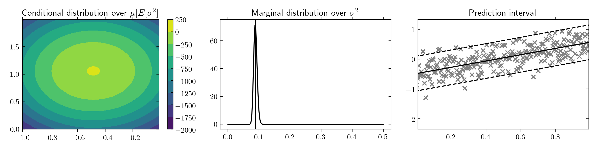

### Conjugate Bayesian Models

Last update: June 2019.

---

Lightweight Python library implementing a few conjugate Bayesian models. For details on the derivations see [1].

```
pip3 install conjugate-bayes
```

We support the following:

#### To fit distribution models

- Beta-Bernoulli
- Gamma-Poisson
- Normal-Inverse-Gamma

#### To fit regression models

- Linear regression with Normal Inverse-Gamma prior
- Linear regression with Zellner's *g*-prior

#### Future work

- Dirichlet-Multinomial
- Normal-Inverse-Wishart

#### Usage

Below we show an example fitting a simple Bayesian linear regression with unknown beta and unknown variance.

```python
model = NIGLinearRegression(mu=np.zeros(2), v=100*np.eye(2), a=0.5, b=0.5)
model.fit(x_tr, y_tr)

sigma2 = model.get_marginal_sigma2()
beta = model.get_conditional_beta(sigma2=sigma2.mean())
```

The above example results in the following prediction intervals.



For further details the `examples/` folder.

#### References

[1] P. D. Hoff, A First Course in Bayesian Statistical Methods (New York: Springer-Verlag, 2009).

#### License

This library is available under the MIT License.